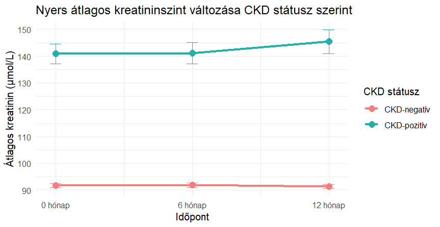
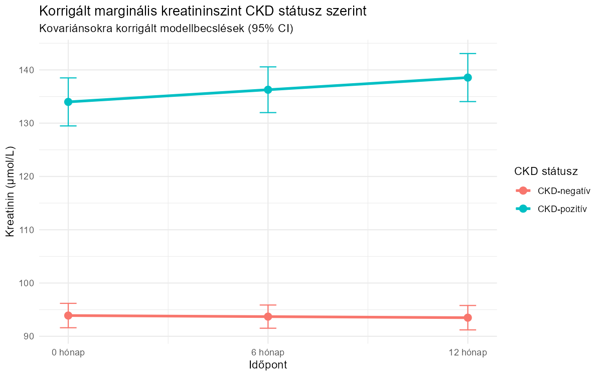
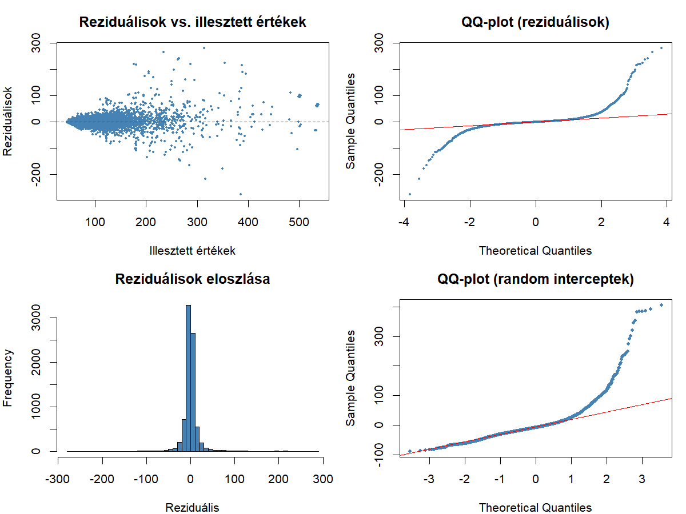

# Longitudinal Creatinine Trajectories by CKD Status in Type 2 Diabetes Patients

**Lajos Háló, PharmD**

*Portfolio project developed as part of a Biostatistics course.*

**Keywords:** R • Linear Mixed-Effects Models • Biostatistics • Longitudinal Analysis • Clinical Data

---

## Project Overview

An observational longitudinal analysis based on a missForest-imputed dataset of 2,669 Hungarian type 2 diabetes mellitus (T2DM) patients. The study examines whether chronic kidney disease (CKD) status is associated with a differential creatinine trajectory over a 12-month follow-up window following initiation of glucose-lowering therapy.

---

## Research Question

> Is there a difference in the magnitude of creatinine change over the 12-month follow-up period after initiation of glucose-lowering therapy between CKD-positive and CKD-negative T2DM patients, after adjusting for age, sex, BMI, hypertension, and treatment group?

### Hypotheses

- **H₀:** The creatinine trajectory over time does not differ between CKD-positive and CKD-negative patients during the 12-month follow-up, after adjusting for covariates.
- **H₁:** The creatinine trajectory over time differs significantly between the two groups.

---

## Data

| Feature | Value |
|---|---|
| Sample | N = 2,669 Hungarian T2DM patients |
| Imputation | missForest algorithm |
| Treatment | DPP-4 inhibitor (n=955) vs. GLP-1 RA (n=1,714) |
| CKD status | Positive: n=562 (21.1%) / Negative: n=2,107 (78.9%) |
| Outcome | Creatinine (µmol/L) at 0, 6, and 12 months |

---

## Methods

### Imputation
Missing data were handled using **missForest**, a non-parametric random forest-based approach suitable for mixed-type data. Prior to imputation, Little's MCAR test indicated no significant deviation from a completely random missing data pattern, supporting the validity of the imputation approach.

### Descriptive Statistics
- TableOne stratified by CKD status, with p-values and standardized mean differences (SMD)
- Distribution assessed via Shapiro-Wilk test and histograms
- Note: creatinine variables showed right-skewed distributions; median [IQR] and Mann-Whitney U tests would have been statistically more appropriate — acknowledged as a limitation

### Inferential Model
**Linear Mixed Effects Model (LME)** — `lme4` / `lmerTest` packages

```r
lme_model <- lmer(
  creatinine ~ time * ckd + age_at_index + gender + bmi +
    hypertension + treatment_group + (1 | patient_id),
  data = t2dm_long,
  REML = TRUE
)
```

Rationale for LME:
- Repeated measures from the same patients → independence assumption violated
- Random intercept at patient level → accounts for between-patient baseline differences
- ICC = 0.808 → 80.8% of variance attributable to between-patient differences

---

## Key Results

### Descriptive Statistics

| Variable | CKD-negative (n=2,107) | CKD-positive (n=562) | p-value | SMD |
|---|---|---|---|---|
| Age, years | 62.33 ± 13.11 | 67.35 ± 12.00 | <0.001 | 0.399 |
| Male sex | 45.0% | 59.4% | <0.001 | 0.291 |
| BMI, kg/m² | 32.57 ± 3.27 | 32.39 ± 3.13 | 0.242 | 0.056 |
| T2DM duration, years | 8.73 ± 4.43 | 9.69 ± 4.14 | <0.001 | 0.223 |
| Hypertension | 56.7% | 73.8% | <0.001 | 0.367 |
| GLP-1 RA treatment | 67.8% | 50.9% | <0.001 | 0.349 |
| Creatinine – baseline, µmol/L | 91.82 ± 36.93 | 140.91 ± 88.45 | <0.001 | 0.724 |
| Creatinine – 12 months, µmol/L | 91.41 ± 38.04 | 145.48 ± 105.93 | <0.001 | 0.679 |

> SMD < 0.1: negligible difference; 0.1–0.2: small; > 0.2: meaningful imbalance. Note: p-values in large samples (N=2,669) may flag clinically negligible differences as significant (e.g. BMI SMD = 0.056).

### LME Model — Fixed Effects

| Variable | β (µmol/L) | SE | 95% CI | p-value |
|---|---|---|---|---|
| CKD-positive (baseline) | +40.09 | 2.57 | 35.05 – 45.13 | <0.001 |
| Time (months) | -0.03 | 0.06 | -0.15 – 0.09 | 0.579 |
| **Time × CKD (interaction)** | **+0.41** | **0.13** | **0.16 – 0.67** | **0.002** |
| Age (years) | +1.13 | 0.08 | 0.98 – 1.28 | <0.001 |
| Male sex | +15.60 | 1.98 | 11.71 – 19.48 | <0.001 |
| BMI (kg/m²) | -1.07 | 0.30 | -1.66 – -0.47 | <0.001 |
| Hypertension | +0.56 | 2.04 | -3.45 – 4.56 | 0.785 |
| GLP-1 RA vs. DPP-4i | -21.48 | 2.17 | — | <0.001 |

> Reference categories: CKD-negative, female sex, DPP-4 inhibitor treatment.

### Estimated Marginal Slopes (emtrends)

| Group | Slope (µmol/L/month) | 95% CI | Interpretation |
|---|---|---|---|
| CKD-negative | -0.03 | -0.15 – 0.09 | No statistically detectable linear change |
| CKD-positive | +0.38 | 0.15 – 0.61 | Significant upward trajectory |

The interaction coefficient (+0.41) reflects the difference in slopes between groups. The CKD-positive group's slope was separately confirmed to differ significantly from zero via `emtrends()`.

### Model Fit

| Metric | Value | Interpretation |
|---|---|---|
| R² (conditional) | 0.845 | Total variance explained (fixed + random effects) — largely driven by between-patient random intercepts |
| R² (marginal) | 0.195 | Fixed effects alone |
| ICC | 0.808 | 80.8% of variance due to stable between-patient differences |
| RMSE | 19.58 µmol/L | In-sample conditional prediction error; not an external validation metric |

---

## Visualisations

### Raw Mean Trajectories

Unadjusted group mean creatinine levels by CKD status (±SE):



### Adjusted Marginal Trajectories

Model-estimated creatinine trajectories by CKD status, adjusted for age, sex, BMI, hypertension and treatment group (95% CI shown):



### Residual Diagnostics



---

## Sensitivity Analyses

### 1. Time as factor variable
Modelling time as a categorical variable (0, 6, 12 months) revealed that the CKD × time interaction was non-significant at 0–6 months but significant at 0–12 months (β = +4.97 µmol/L, p = 0.002), suggesting the creatinine divergence was concentrated in the 6–12 month interval rather than being strictly linear.

### 2. Log-transformed outcome
A model with log(creatinine) as outcome showed markedly improved homoscedasticity. However, the CKD × time interaction was no longer statistically significant (p = 0.423), indicating that the interaction on the original scale was partly attributable to the influence of extreme values and heteroscedasticity. This limits the robustness of the primary finding.

### 3. Random slope model
A model allowing patient-specific time slopes `(time | patient_id)` could not be fitted stably (convergence failure), likely attributable to the limited number of repeated measurements (three time points). The between-patient slope variance estimate (SD = 1.48 µmol/L/month) suggests individual trajectories vary, but reliable estimation requires more time points.

---

## Limitations

1. **Extreme creatinine values** (max. 603 µmol/L) — likely associated with severely impaired renal function or acute kidney injury; residual diagnostics confirmed heteroscedasticity and heavy tails
2. **Binary CKD definition** — severity (e.g. GFR stage) not captured, masking within-group heterogeneity
3. **Potential circularity** — CKD status was likely defined using eGFR derived from creatinine, making the baseline CKD–creatinine association partly definitional; the key inferential question is therefore the difference in *trajectories*
4. **Descriptive statistics** — right-skewed creatinine distributions warrant median [IQR] and Mann-Whitney U tests rather than mean ± SD and t-tests
5. **Observational design** — associations reported throughout; causal inference is not possible; unmeasured confounders may influence results
6. **Therapeutic context** — treatment group distribution differed significantly between CKD strata (CKD-negative: 67.8% GLP-1 RA vs. CKD-positive: 50.9% GLP-1 RA, p<0.001); observed trajectory differences should be interpreted alongside this differential treatment background
7. **Sensitivity analysis** — the CKD × time interaction was not significant on the log scale, highlighting the conditional nature of the primary finding
8. **Follow-up duration** — 12 months is relatively short for characterising long-term renal trajectories

---

## Repository Structure

```text
.
├── data/              # Input datasets (excluded if confidential)
├── scripts/           # R analysis scripts
├── figures/           # Figures used in the README
├── output/            # Tables and model outputs
├── README.md
└── LICENSE
```

## Reproducibility

1. Clone this repository.
2. Install the required R packages.
3. Run the analysis scripts in the `scripts/` directory.
4. Figures and tables will be generated automatically.

## R Packages

```r
library(missForest)    # missing data imputation
library(tableone)      # descriptive statistics
library(lme4)          # linear mixed effects model
library(lmerTest)      # p-values for LME
library(emmeans)       # marginal slopes and adjusted estimates
library(performance)   # goodness-of-fit metrics
library(tidyverse)     # data manipulation
library(ggplot2)       # visualisation
```

---

## Summary

This project analysed creatinine trajectories over a 12-month follow-up in 2,669 T2DM patients using a linear mixed effects model on missForest-imputed data. A significant CKD × time interaction was identified on the original scale (β = +0.41 µmol/L/month, 95% CI: 0.16–0.67, p = 0.002), though this finding was not robust to log-transformation of the outcome (p = 0.423), with the CKD-positive group showing an estimated upward slope of +0.38 µmol/L/month (95% CI: 0.15–0.61), while no statistically detectable linear change was observed in the CKD-negative group (β = -0.03, p = 0.579). All findings are associational; causal conclusions cannot be drawn from this observational dataset.

---

*Biostatistics Course Project — RobotDreams | 2026*


---

## Disclaimer

This project was developed for educational and portfolio purposes. It is not intended for clinical decision-making or medical use. The code and analyses are provided without warranty.
